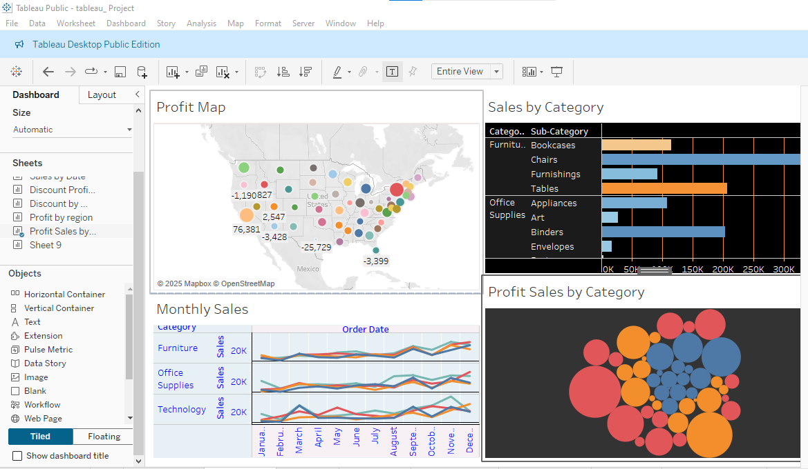

# Tableau Sales Performance Dashboard 1 📊  

This project features an interactive **Tableau Dashboard** designed for analyzing sales trends, profits, and category-wise performance across different regions.  

## 📌 Features  
- **Profit Map**: A geographical visualization displaying profit distribution across different states.  
- **Sales by Category**: A bar chart showcasing sales distribution across different product categories and subcategories.  
- **Monthly Sales**: A line chart tracking sales trends over the months for different product categories (Furniture, Office Supplies, and Technology).  
- **Profit Sales by Category**: A bubble chart illustrating the profit contribution of different product categories.
  # Tableau Sales Analysis Dashboard 2 📊  

This project contains an interactive **Tableau Dashboard** for analyzing sales data, discount trends, and profit distribution across different regions.  

## 📌 Features  
- **Discount Profit Map**: Displays profit and discount impact across different U.S. states.  
- **Profit by Region**: A donut chart showing the percentage of profit contribution from different regions.  
- **Discount by Quantity**: Scatter plot visualizing the relationship between discount and quantity sold.  
- **Sales by Date**: A time-series line chart showing sales trends from 2018 to 2021.  

## 🚀 Installation & Usage  
1. **Download and Install Tableau Public** from [Tableau Public](https://public.tableau.com/).  
2. Open the Tableau workbook file containing this dashboard.  
3. Interact with the dashboard to explore sales patterns, profit trends, and category-wise performance.  

## 🛠 Technologies Used  
- **Tableau Public** for interactive data visualization  
- **Mapbox** for geographic data representation  

## 📷 Dashboard Preview  
  
  

## 🤝 Contribution  
Feel free to fork the repository and submit a pull request for improvements or modifications.  

## 📝 License  
This project is under the MIT License.  
